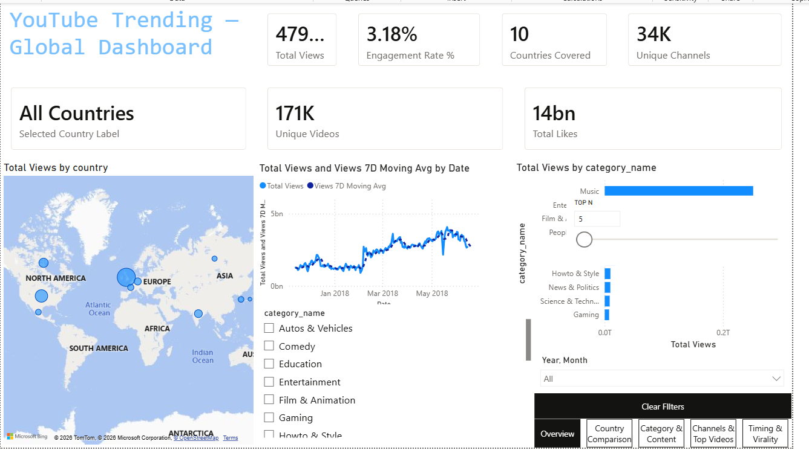

# 🎬 YouTube Trending — Global Analytics Dashboard

An end-to-end analytics project on the **YouTube Trending Videos** dataset, covering
**all 10 countries** (not just the US): data cleaning in Python → modelling in Power BI →
a 5-page interactive dashboard → a Streamlit gallery for sharing.



---

## 📌 Project Overview

| | |
|---|---|
| **Dataset** | [YouTube Trending Videos — Kaggle](https://www.kaggle.com/datasets/datasnaek/youtube-new) |
| **Scope** | 10 countries — US, GB, CA, DE, FR, IN, JP, KR, MX, RU |
| **Rows** | **342,656** cleaned trending records (from 375,942 raw) |
| **Trending window** | 2017-11-14 → 2018-06-14 |
| **Tools** | Python (pandas, ftfy), Power BI, Streamlit |
| **Domain** | Social Media / Content Analytics |

---

## 🗂️ Repository Structure

```
youtube-trending-dashboard/
├── README.md                         ← this file
├── BUILD_GUIDE.md                    ← step-by-step Power BI build instructions
├── app.py                            ← Streamlit dashboard gallery
├── requirements.txt                  ← Streamlit app dependencies
├── cleaning_script/
│   └── cleaning_all_countries.py     ← the full cleaning pipeline (10 countries)
├── dashboard/
│   └── AdvancedDashboard.pbix        ← the Power BI report
├── data/
│   ├── raw/                          ← original Kaggle CSVs + category JSONs
│   └── cleaned/                      ← youtube_all_countries.csv (generated)
└── screenshots/                      ← exported dashboard page images
```

---

## 🔧 Data Cleaning (Python)

All 10 countries are joined into one analysis-ready fact table by
`cleaning_script/cleaning_all_countries.py`. Per country, then combined:

1. **Robust CSV load** — `latin1` + custom quoting recovers all 40k+ rows per file.
2. **Country identity** — adds `country_code` and full `country` name to every row.
3. **Dates** — `trending_date` & `publish_date` → ISO `YYYY-MM-DD`; derives `publish_hour`, `publish_weekday`.
4. **Category mapping** — each country's **own** `*_category_id.json` → `category_name`.
5. **Tags** — parses `"a"|"b"` → clean `a | b` + `tag_count`.
6. **Numeric cleanup** — views / likes / dislikes / comments → clean integers.
7. **Derived metrics** — `engagement_rate`, `like_dislike_ratio`, `days_to_trend`, `views_bucket`.
8. **Null removal** — drops any row with a null in any source column.
9. **Text repair (ftfy)** — fixes `latin1` **mojibake** so Japanese / Korean / Cyrillic / accented
   titles render correctly (e.g. `é` → `é`), and collapses whitespace.
10. **Logical sanity filters** — removes `views = 0`, likes/dislikes/comments > views,
    removed/errored videos, and rows that "trend before publish".
11. **De-duplication** — one record per `video_id` + `country` + `trending_date`; final exact-row sweep.
12. **QA assertion** — confirms **0 nulls** before saving `youtube_all_countries.csv`.

**Result:** 375,942 → **342,656 rows**, 25 columns, 0 nulls, repaired Unicode, no duplicates.

### Run it
```bash
pip install pandas ftfy
python cleaning_script/cleaning_all_countries.py
```

---

## 📊 Dashboard Pages

### 1 — Overview (Executive Summary)
KPI cards (Total Views, Engagement Rate %, Countries, Unique Videos, Unique Channels), a
**world map** of views by country, a **views-over-time** line with a 7-day moving average, and a
**top-categories** chart. Global slicers for country & category.


### 2 — Country Comparison
Views vs engagement by country, a **country × category matrix** (heat-formatted), an
**efficiency-quadrant scatter** (avg views per video vs engagement), and **small-multiple**
daily trend lines per country.


### 3 — Category & Content
**Engagement Rate %** and **Like/Dislike Ratio** by category, a **treemap** of total views,
and a **views-bucket histogram** showing the view-size distribution of trending videos.


### 4 — Channels & Top Videos
Top **channels** table (views, unique videos, engagement, rank — with data bars) and a top
**videos** table with rendered **thumbnails**. Drill-through target from the other pages.


### 5 — Timing & Virality
A **publish weekday × hour heatmap** (best time to publish), a **days-to-trend** histogram,
average days-to-trend over time, and a **speed-vs-engagement** scatter.


---

## 💡 Key Insights

- 🎵 **Music & Entertainment** dominate global trending views by a wide margin.
- 🌍 **Country mix differs sharply** — e.g. India/Russia over-index on Entertainment & Film,
  while the US/GB skew toward Music and Comedy.
- 🤝 **Nonprofits & Activism / Education** drive the highest *engagement rate*, even though
  Music wins on raw views — reach ≠ engagement.
- ⚡ Most videos trend **fast** — median ~1 day, average ~7.6 days from publish to trending.
- 🏷️ Most trending videos sit in the **100K–1M views** band; the 20M+ tier is rare.

---

## 🚀 Share / Host the Dashboard

A **Streamlit** app (`app.py`) presents the exported dashboard pages as an interactive gallery —
ideal for hosting on **Streamlit Community Cloud** when you can't publish to the Power BI Service.

```bash
pip install -r requirements.txt
streamlit run app.py
```

Then deploy free: push this repo to GitHub → [share.streamlit.io](https://share.streamlit.io)
→ **New app** → point it at `app.py`.

---

## 🔁 Reproduce From Scratch
1. Download the Kaggle dataset into `data/raw/`.
2. `python cleaning_script/cleaning_all_countries.py` → produces `youtube_all_countries.csv`.
3. Open `dashboard/AdvancedDashboard.pbix` (or rebuild via **BUILD_GUIDE.md**) and point it at the CSV.
4. `streamlit run app.py` to preview/share the gallery.
